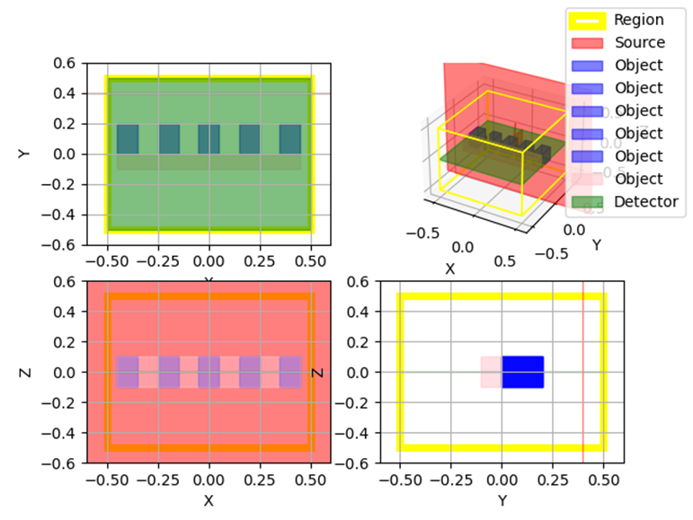

# NewFDTD v0.1-20240603
## 1.简介
NewFDTD软件为一款基于Python的开源FDTD算法电磁场仿真软件。

软件基于MIT开源协议，这意味着该软件基本允许任何形式的使用、修改、再发布。

作者为 Llessac

该软件分为两个部分：NewFDTDCalculation模块,负责完成仿真计算的完整功能、NewFDTD(GUI)模块，负责方便用户可视化操作进行仿真计算。两个模块可以独立使用。

软件使用numpy、scipy、matplotlib、pyside6、opencv-python、numba、qt_material、PyOpenGL，请确保安装以上Python包后使用该软件

## 2.使用示例
### 2.1 NewFDTDCalculation部分
这个文件提供newFDTDCalculation的使用示例
>test.py

导入模块
>from newFDTDCalculation.grid import *\
>from newFDTDCalculation.object import *\
>from newFDTDCalculation.source import *\
>from newFDTDCalculation.detector import *\
>from newFDTDCalculation.calculation import *

加载并设置仿真程序主框架
>a = Calculation()\
>a.set_space_unit('μm')

设置仿真区域与边界条件
>g = Region(-0.5, 1, -0.5, 1, -0.5, 1, temperate=300, background_index=1.0, boundary="PML")

设置分辨率
>g.set_res(0.01)

添加该区域到仿真程序中
>a.add_Region(g)

设置物体树\
物体树为混合嵌套列表， 可包含物体组ObjectGroup和物体Object，物体组ObjectTree中可嵌套ObjectTree

设置单个物体
>o1 = Rectangle(0, -0.05, 0, 0.9, 0.1, 0.2)\
>o1.color="pink"\
>o1.set_constant_index(2)

设置物体组
>o = ObjectGroup()\
>for i in range(5):\
>    o.append(Rectangle(-0.4 + i * 0.2, 0.1, 0, 0.1, 0.2, 0.2)) # 物体组添加物体\
>    o.objects[-1].color = 'blue'

物体组整体设置折射率
>o.set_constant_index(1.4)

添加物体和物体组到物体树中
>a.add_ObjectTree(o, o1)

设置源
>s = GaussianSource(0, 0.4, 0, 2, 0, 2, "y_plane", direction="Backward")\
>a.add_Source(s)

设置监视器
>m1 = MovieDetector(0, 0, 0, 1, 1, 0, "z_plane","MovieOutput", field_component="Ez")\
>m2 = PointDetector(0, 0, 0, "PointOutput", field_component="Ez")\
>a.add_Detector(m1)
>

保存仿真文件
>a.save("fdtdNew")

显示3D图
>a.show3D()

仿真计算
>a.run()

首先程序会在emulation文件夹下保存仿真文件fdtdNew.json(附录)。

然后会展示仿真空间的3D图及三视图。

该仿真为一个光栅，在光栅前有一个高斯光源，探测器记录侧面的Ez电场值随时间变化情况。

运行仿真时，程序先会在命令行打印出运行参数表：

Parameter table : \
run_length : 101\
run_width : 101\
run_height : 101\
res : 0.01\
dt : 0.015406665679697252\
dt_max : 0.019258332099621564\
boundary_type : PML\
boundary_layers : 8\
pml_sigma : 1\
Mode : Auto Mode.\
The progress bar doesn't have to be complete.

然后会在命令行显示进度条。由于是AutoDone模式，进度条不需要走完便可运行完成。最后在当前目录下生成Detector所记录的视频。

### 2.2 NewFDTD(GUI)部分

(1)新建仿真文件创建仿真

当以GUI模式打开NewFDTD软件时，软件会自动在emulation目录下创建文件default.json，并打开该文件，此时只需要在仿真功能表与工具箱模块中进行设置与添加元件即可。

如图所示，在新建文件后，首先根据需要添加各种元件，然后针对不同元件进行参数的修改，在右上角对象检查器中选中仿真文件后，在右下角属性编辑器中对各参数进行修改，最后点击运行仿真。

(2)打开已有文件进行仿真

如图所示，直接在文件栏中选取打开(Open)项，然后在弹出来的窗口中找到需要的仿真文件，点击打开，仿真文件便导入到程序中了。之后可根据需要对物体参数进行添加、修改与删除，便可以点击运行仿真按钮进行仿真运算。
